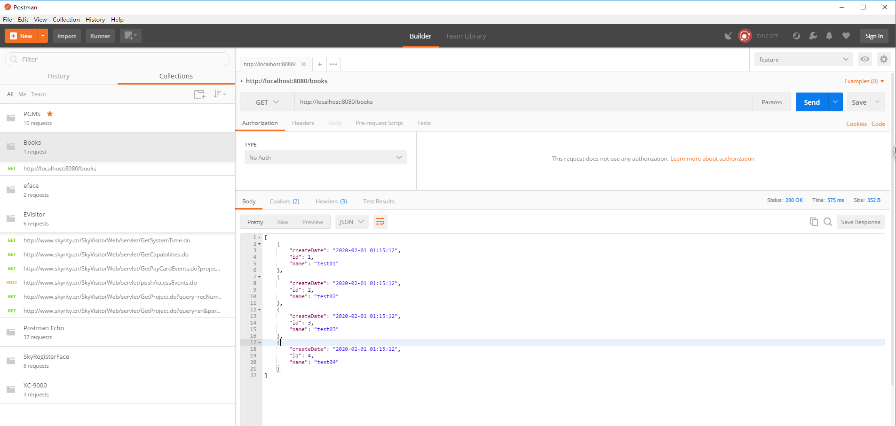

# 图书管理案例说明

## 一、 项目设计目的

### 1.1 学习Vue的使用。

### 1.2 理解Vue的 相关信息。

   ####      1.2.1 依赖引入

   ```
   <script src="https://unpkg.com/vue/dist/vue.js"></script>
   ```

   ####     1.2.2  Vue实例化,了解对象基本结构

```html
   <html>
     <body>
        <div id="app">
        </div>
    </body>
   </html>
```
```javascript
   //实例化Vue对象
   var vm=new Vue({
			el:'#app',
			data:{},
			//方法
			methods:{},
			//计算
			computed:{},
			//侦听器
			watch:{},
			//生命周期函数，代表模板可以使用
			mounted:function(){}
	})
```

- 了解 html 和 Vue的对应关系

- 了解 html 和数据属性对应关系

- 了解方法属性

- 了解计算属性

- 了解侦听器

  

#### 1.2.3 Vue的自定义属性

```javascript
        //自定义命令
	    Vue.directive('focus',{
				inserted:function(el){
					console.log(el)
					el.focus()
				}
				
			})
```


#### 1.2.4 Vue的过滤器

```javascript
Vue.filter('format',function(value,arg){
 })
```


### 1.3 axios 的基本用法

```javascript
//设置axios基本路径
axios.defaults.baseURL='http://localhost:8080/';
axios.get("books").then((ret)=> {
  console.log(ret.data)
  this.books=ret.data;
})
    
```

```javascript
axios.defaults.baseURL='http://localhost:8080/';
//同步方式
async getAllBook(){
    var ret= await axios.get("books");
    this.books=ret.data;
}

```


## 二、图书管理的页面设计


```html
<!DOCTYPE html>
<html>
	<head>
		<meta charset="UTF-8">
		<title>图书管理</title>
		<!--需要引入的依赖-->
		<script src="https://unpkg.com/vue/dist/vue.js"></script>
		<style>
			*{
			 padding: 0;
			 margin: 0;	
			}
			.container{
				
				width: 1024px;
				margin: 0 auto;
			}
			.container h1{
				text-align: center;
				padding: 20px 0 10px 0;
			}
			
			#table1{
				background-color: #CCE8EB;
				border-collapse: collapse;
				margin: 0 auto;
 		        width: 100%;
				font-size: 20px;
				text-align: center;
			}
			#table1 tr{
				height: 50px;
				line-height: 50px;
			}
			#table1 button{
			 font-size: 20px;	
			}
			#table2{
				border-collapse: collapse;
				margin: 0 auto;
				text-align: center;
				width: 100%;
				font-size: 20px;
			}
			#table2 thead th{
				background-color: #CCE8EB;
				
			}
			#table2 tr:nth-child(even){
				background: #F5FAFA;
			}
		</style>
	</head>
	<body>
	
		<div id="app">
		  <div class="container">
		   <h1>图书管理</h1>	
		   <table id="table1" border="1">
		   	 <tr>
		   	 	<td width="40%">
		   	 	  <label>编号：</label>
		   	 	  <input type="text" name="id" v-model="id" :disabled="flag" v-focus/>
		   	 	</td>
		   	 	<td width="40%">
		   	 	  <label>名称:</label>
		   	 	  <input type="text" name="name" v-model="name" />
		   	 	</td width="20%">
		   	 	<td>
		   	 	  <button @click="toAdd" :disabled="submitFlag">提交</button>
		   	 	</td>
		   	 	
		   	 </tr> 
		   	 <tr>
		   	   <td colspan="3">
		   	   	 当前图书数为:{{total}}
		   	   </td>	
		   	 </tr>
		   </table> 	
		   <table id="table2">
		   	<thead>
		   	<tr>
		   	 	<th width="10%">编号</th>
		   	 	<th width="40%">名称</th>
		   	 	<th width="30%">修改时间</th>
		   	 	<th width="20%">操作</th>
		   	 </tr>
		    </thead>
            <tbody>
             <tr :key="book.id" v-for="book in books" >
             	<td>{{book.id}}</td>
             	<td>{{book.name}}</td>
             	<td>{{book.createDate | format('YYYY-mm-dd HH:MM:SS') }}</td>
             	<td>
             	  <a href="" @click.prevent='toEdit(book.id)'>修改</a>	
             	  <span> | </span>
             	  <a href="" @click.prevent='toDelete(book.id)'>删除</a>	
             	</td>
             	
             </tr>	
            
            </tbody>
		   	 
		   </table>	
		 </div>  
		</div>
	 </body>
</html>
```
```javascript
	<script>
		
	    //自定义命令
	    Vue.directive('focus',{
				inserted:function(el){
					console.log(el)
					el.focus()
				}
				
			})
         //定义日期格式过滤器
         Vue.filter('format',function(value,arg){
       	
            function dateFormat(date,fmt) {
			    let ret;
			    const opt = {
			        "Y+": date.getFullYear().toString(),        // 年
			        "m+": (date.getMonth() + 1).toString(),     // 月
			        "d+": date.getDate().toString(),            // 日
			        "H+": date.getHours().toString(),           // 时
			        "M+": date.getMinutes().toString(),         // 分
			        "S+": date.getSeconds().toString()          // 秒
			        // 有其他格式化字符需求可以继续添加，必须转化成字符串
			    };
			    for (let k in opt) {
			        ret = new RegExp("(" + k + ")").exec(fmt);
			        if (ret) {
			            fmt = fmt.replace(ret[1], (ret[1].length == 1) ? (opt[k]) : (opt[k].padStart(ret[1].length, "0")))
			        };
			    };
			    return fmt;
		    }  

             return dateFormat(value,arg);
       	
        })
	    //实例化Vue对象
		var vm=new Vue({
			el:'#app',
			data:{
				id:'',
				name:'',
				flag:false,
				submitFlag:false,
				books:[]
			},
			//方法
			methods:{
			  	toAdd:function(){
			  	 if(!this.flag){
			  	 	//添加图书
			  	  var book={};
			  	  book.id=this.id;
			  	  book.name=this.name;
			  	  book.createDate=new Date()
			  	  this.books.push(book);
			  	 }else{
			  	 	//修改图书
			  	 	this.books.some(item=>{
			  	 		if(item.id==this.id){
			  	 			item.name=this.name 
			  	 			return true
			  	 		}
			  	 	})
			  	 }
			  	  this.id='';
			  	  this.name='';
			  	  this.flag=false
			  	},
			  	toEdit:function(id){
			  		
			  		var books=this.books.filter(function(item){
			  			return item.id==id
			  		})
			  		console.log(books)
			  		this.id=books[0].id
			  		this.name=books[0].name
			  		this.flag=true
			  		
			  	},
			  	toDelete:function(id){
			  		console.log(id)
			  		
			  	//第1种方法	
			  	this.books=this.books.filter(function(item){
			  		return item.id!==id
			  	})
			  	//第2种方法
//			  		var index=this.books.findIndex(function(item){
//			  			return item.id=id
//			  		})
//			  		this.books.splice(index,1);
			  	}
			},
			//计算
			computed:{
			  total:function(){
			  	return this.books.length;
			  }
			},
			//侦听器
			watch:{
			   name:function(val){
			   	  var flag=this.books.some(function(item){
			   	    	return item.name===val;
			   	  })
			   	  if(flag){
			   	  	this.submitFlag=true
			   	  }else{
			   	  	this.submitFlag=false
			   	  }	
			   }
			},
			//生命周期函数，代表模板可以使用
			mounted:function(){
				var data=[
				  {
				  	id:1,
				  	name:'test01',
				  	createDate:new Date(1569895200000),
				  },
				  {
				  	id:2,
				  	name:'test02',
				  	createDate:new Date(1569985200000),
				  },
				  {
				  	id:3,
				  	name:'test03',
				  	createDate:new Date(1569985200000),
				  },
				  {
				  	id:4,
				  	name:'test04',
				  	createDate:new Date(1569985200000),
				  }
			
				]
				this.books=data;
			}
			
		})
		
		
	</script>
	


```


## 三、图书管理需要调用的后台接口

1. 图书列表数据加载 		                GET               http://localhost:8080/books
2. 添加图书                                        POST            http://localhost:8080/books
3. 验证图书名称是否存在                 GET               http://localhost:8080/books/book/:name
4. 编辑图书-根据ID查询图书信息    GET               http://localhost:8080/books/:id
5. 编辑图书-提交图书信息                PUT              http://localhost:8080/books/:id
6. 删除图书                                        DELETE        http://localhost:8080/books/:id


## 四、接口详细说明

> _基本路径：http://localhost:8080/_

### 4.1 图书列表数据加载

- **路径 books**

- **请求类型：** GET

- **请求参数**

  ​	无

- **响应结果**

  ```javascript
  [
      {
          "createDate":"2020-02-01 12:47:23",
          "id":1,
          "name":"test01"
      },
      {
          "createDate":"2020-02-01 12:47:23",
          "id":2,
          "name":"test02"
      },
      {
          "createDate":"2020-02-01 12:47:23",
          "id"
          :3,
          "name":"test03"
      },
      {
          "createDate":"2020-02-01 12:47:23",
          "id":4,
          "name":"test04"
      }
  ]
  ```

  

### 4.2 添加图书

- **路径 books**

- **请求类型：** POST

- **请求体Body**

   ```
   {
   	"name":"test05" //图书名称
   }
   ```

   

- **响应结果**

   ```javascript
   成功
   {
       "result_code": 0,
       "result_msg": "操作成功",
       "result_time": 1580619576188,
       "result_data": {
           "createDate": "2020-02-02 12:59:36",
           "id": 5,
           "name": "test05"
       }
   }
   失败
   {
       "result_code": -2,
       "result_msg": "书名重复，操作失败！",
       "result_time": 1580619607134
   }
   ```


### 4.3 验证图书名称是否存在


- **路径 books/book/:name**

- **请求类型：** Get

- **请求参数**

  ​	无

- **响应结果**

  ```javascript
  {
      "result_code": 0,
      "result_msg": "操作成功",
      "result_time": 1580537263364,
      "result_data": {
          "flag": true // true=存在，false=不存在
      }
  }
  ```


### 4.4 编辑图书-根据ID查询图书信息


- **路径 books/:id**

- **请求类型：** Get

- **请求参数**

  ​	无

- **响应结果**

  ```javascript
  {
      "result_code": 0,
      "result_msg": "操作成功",
      "result_time": 1580615297553,
      "result_data": {
          "createDate": "2020-02-02 11:44:24",
          "id": 1,
          "name": "test01"
      }
  }
  ```


### 4.5 编辑图书-提交图书信息


- **路径 books/:id**

- **请求类型：** PUT

- **请求体Body**

  ```javascript
  {
  	"name":"test05" //图书名称
  }
  ```

  

  

- **响应结果**

  ```javascript
  成功
  {
      "result_code": 0,
      "result_msg": "操作成功",
      "result_time": 1580617874146,
      "result_data": {
          "createDate": "2020-02-02 12:31:14",
          "id": 5,
          "name": "test05-1"
      }
  }
  失败
  {
      "result_code": -1,
      "result_msg": "没有找到该图书，操作失败！",
      "result_time": 1580617830399
  }
  ```


### 4.5 删除图书


- **路径 books/:id**

- **请求类型：** DELETE

- **请求参数**

  ​	无

- **响应结果**

  ```javascript
  成功
  {
      "result_code": 0,
      "result_msg": "操作成功",
      "result_time": 1580616394217,
      "result_data": {
          "createDate": "2020-02-02 12:06:24",
          "id": 5,
          "name": "test05"
      }
  }
  失败
  {
      "result_code": -1,
      "result_msg": "没有找到该图书，操作失败！",
      "result_time": 1580616425630
  }
  ```

